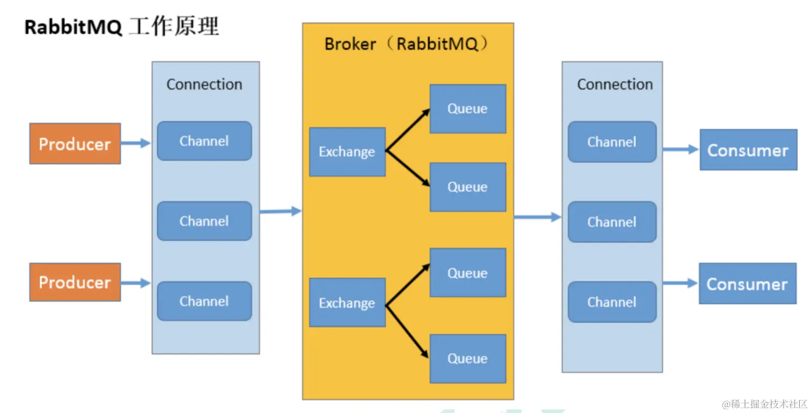

# 信息队列

前端监控系统会收到很多来自用户端的请求，如果直接存入数据库很容易把数据库服务搞挂掉，所以一般会加一个 RabbitMQ 来缓冲。它是生产者往 queue 里放入消息，消费者从里面读消息，之后确认消息收到的流程。

RabbitMQ 在后端系统中经常能见到，是很常用的中间件。比如前端监控系统的后端服务，就很适合使用 mq 来做流量削峰。

RabbitMQ 解决了以下问题：
流量削峰：可以把很大的流量放到 mq 种按照一定的流量上限来慢慢消费，这样虽然慢一点，但不至于崩溃。
应用解耦：应用之间不再直接依赖，就算某个应用挂掉了，也可以再恢复后继续从 mq 中消费消息。并不会一个应用挂掉了，它关联的应用也挂掉。

## 概念

## RabbitMQ 工作原理



Producer 和 Consumer 分别是生产者和消费者。
Connection 是连接，但我们不会每用一次 rabbitmq 就创建一个单独的 Connection，而是在一个 Connection 里做一下划分，叫做 Channel，每个 Channel 做自己的事情。
Queue 就是两端存取消息的地方了。
Broker 是整个接收消息和转发消息的服务。
Exchange 是把消息放到不同的队列里用的，叫做交换机。

当一对多的时候，还要加一个 Exchange 交换机来根据不同的规则转发消息：

我们前面生产者和消费者都是直接指定了从哪个队列存取消息，如果是一对多的场景，总不能一个个的调用 sendQueue 发消息吧？这时候就要找一个 Exchange（交换机） 来帮我们完成把消息按照规则放入不同的 Queue 的工作了。

Exchange 主要有 4 种：

direct 交换机：根据 routing key 转发消息到队列，把消息放到交换机的指定 key 的队列 🌰：producer-direct.js consumer-direct、2.js
topic 交换机：根据 routing key 转发消息到队列，支持模糊匹配。把消息放到交换机的指定 key 的队列，支持模糊匹配 🌰：producer-topic.js consumer-topic、2.js
headers 交换机：根据 headers 转发消息到队列，把消息放到交换机的满足某些 header 的队列
fanout 交换机：广播消息到交换机下的所有队列，把消息放到这个交换机的所有 Queue

## MQ 的流量削峰

MQ 的并发量比数据库高很多。之前 web 服务要等数据库存储完成才能响应，而现在只存入 MQ 就可以响应了。那可以支持的并发量就更多。
而数据库的并发比较低，我们可以通过 MQ 把消费的上限调低，就能保证数据库服务不崩。比如 10w 的消息进去 MQ，每次只从 MQ 中取出 1000 来消费。并发量被控制住了，自然就崩不了了，从 MQ 中取出慢慢处理就好了。这就是流量削峰的功能。

## 运行

### 通过 docker 来跑 RabbitMQ

搜索 rabbitmq 的镜像，选择 3.11-management 的版本，这个版本是有 web 管理界面的。

```sh
docker pull rabbitmq:3.11-management
# 15672 是管理界面的，5672 是 mq 服务的端口。
docker run -d --hostname my-rabbit --name some-rabbit -p 15672:15672 -p 5672:5672 rabbitmq:3.11-management
```

## 管理界面

等 rabbitmq 跑起来之后就可以在浏览器访问 http://localhost:15672 了，用户名密码 guest、guest，进去后可以看到 connection、channel、exchange、queue 的分别的管理页面。

在管理页面可以管理队列，进行删除队列等操作。

```sh
mkdir rabbitmq-test
cd rabbitmq-test
npm init -y

npm install amqplib

# 发送一个队列
node ./src/producer.js
node ./src/consumer.js

# 不断发送队列
node ./src/producer-timer.js
node ./src/consumer-timer.js

# 交换机 direct
node ./src/producer-direct.js
node ./src/consumer-direct.js
node ./src/producer-direct-2.js

# 交换机 topic
# 在管理页面 http://localhost:15672/#/exchanges/%2F/direct-test-exchange2 的 publish message 也可以发送信息
node ./src/producer-topic.js
node ./src/consumer-topic.js
node ./src/producer-topic-2.js

# 交换机 fanout
node ./src/producer-fanout.js
node ./src/consumer-fanout.js
node ./src/producer-fanout-2.js

# 交换机 headers
node ./src/producer-headers.js
node ./src/consumer-headers.js
node ./src/producer-headers-2.js
```

amqplib 是 rabbitmq 的 node 客户端（amqp 是 rabbitmq 的协议）。
rabbitmq 要用 es module 语法并且支持顶层 await 需要在 packege.json 里设置 type 为 module

🌰: 
src/producer.js: 连接 rabbitmq 服务，创建一个名字为 aaa 的队列，并向队列中发送了一个消息。
src/consumer.js: 消费端
src/producer-timer.js: 生产者每 0.5s 发送一次消息
src/consumer-timer.js: 消费者一开始取出 3 条，然后每处理完一条取一条，保证最多并发处理 3 条。这就是流量削峰的功能。不同服务之间的速度差异可以通过 MQ 来缓冲。
